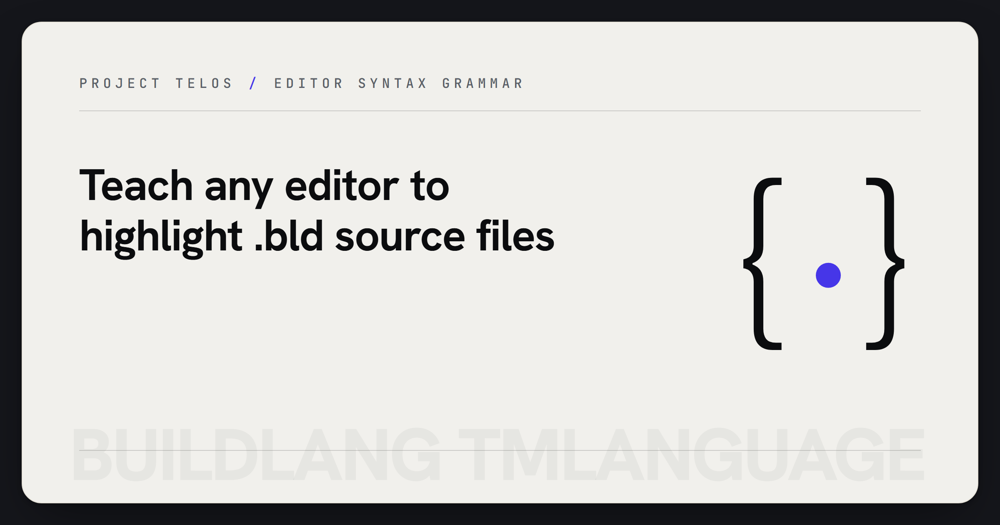

  

# BuildLang TextMate Grammar

> The editor-facing TextMate grammar that teaches syntax highlighters how to read `.bld` files.

Official TextMate grammar for **[BuildLang](https://github.com/HarperZ9/buildlang)**.
This is the small editor-facing layer that teaches syntax highlighters how to
read `.bld` files without carrying compiler behavior or backend claims.

## What this is

A language definition that tells syntax-highlighting engines how to render `.bld` source files. The same grammar powers:

- The BuildLang VS Code extension
- Syntax highlighting on GitHub (via [github-linguist](https://github.com/github-linguist/linguist))
- Any TextMate-compatible editor (Sublime Text, TextMate, Atom, etc.)

## Files

| Path | Purpose |
|------|---------|
| `grammars/buildlang.tmLanguage.json` | The grammar definition |
| `language-configuration.json` | Comment tokens, brackets, surrounding-pair rules |
| `samples/` | Representative `.bld` files used by linguist for language detection |

## BuildLang in brief

BuildLang is an effects-oriented systems language. Keywords in this grammar fall into several categories:

- **Classical systems keywords** - `fn`, `struct`, `enum`, `trait`, `impl`, `let`, `mut`, `pub`, `mod`, `use`, `if`, `else`, `match`, `loop`, `while`, `for`, `in`, `return`, `break`, `continue`, `ref`, `move`, `unsafe`, `extern`, `async`, `await`, `dyn`, `where`, `typeof`, `sizeof`, `true`, `false`, `Self`, `self`, `crate`, `super`
- **Effect system** - `with`, `effect`, `handle`, `resume`, `perform`
- **AI/neural primitives** - `ai`, `neural`, `infer`
- **Module system** - `module` (ecosystem-level), alongside standard `mod`
- **Macros** - `macro`, `macro_rules`
- **Reserved** - `abstract`, `become`, `do`, `final`, `override`, `priv`, `try`, `yield`, `union`, `default`, `auto`, `box`

Primitive types recognized: `i8`, `i16`, `i32`, `i64`, `i128`, `isize`, `u8`, `u16`, `u32`, `u64`, `u128`, `usize`, `f32`, `f64`, `bool`, `char`, `str`, `String`, and common standard types (`Vec`, `Option`, `Result`, `Box`, `Rc`, `Arc`, `HashMap`, `HashSet`, `BTreeMap`, `BTreeSet`).

## Usage

This is a TextMate grammar package, not a compiler or runnable program: there is
no CLI to run and nothing to import. "Using" it means installing the grammar into
a TextMate-compatible editor (or consuming it via github-linguist) so `.bld`
files get syntax highlighting. See **[USAGE.md](USAGE.md)** for install steps per
editor, the grammar's scope name and file type, the JSON-validation/packaging
commands, and worked highlighting examples.

The compiler and any `buildc` command live in the separate
[`HarperZ9/buildlang`](https://github.com/HarperZ9/buildlang) repository, not
here.

## Using this grammar

### VS Code

Install the [BuildLang VS Code extension](https://marketplace.visualstudio.com/items?itemName=HarperZ9.buildlang) - it bundles this grammar.

### Sublime Text / TextMate

Place the grammar file in the appropriate packages directory. Sublime Text accepts `.tmLanguage.json` directly since ST4.

### github-linguist

This repository is included as a submodule by `github-linguist/linguist` under `vendor/grammars/buildlang-tmLanguage`. Consumers do not need to install anything.

## License

MIT. See [LICENSE](LICENSE).
